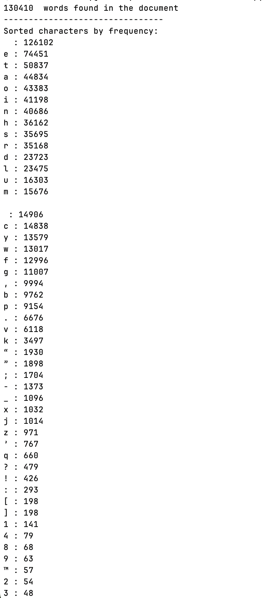
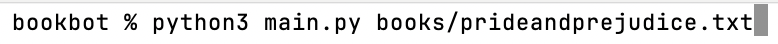

# bookbot

bookbot is a project built as part of the boot.dev course

# How to use

It is a CLI command that will count the number of characters and give you a split of characters.
Example:


To get things going:

1. Install python3
2. clone this repo
3. Run the CLI command:

```
python3 main.py {path_to_the_book}
```


